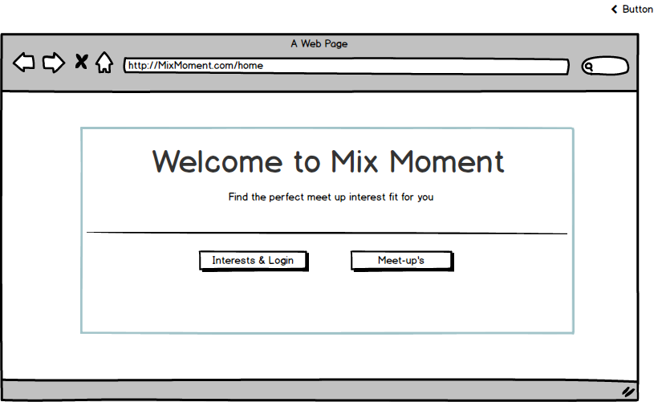
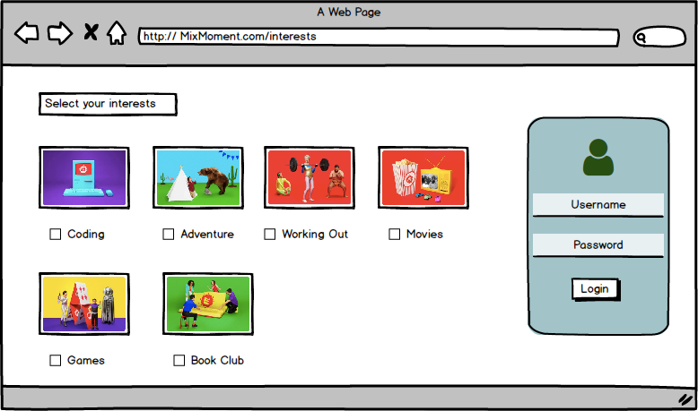
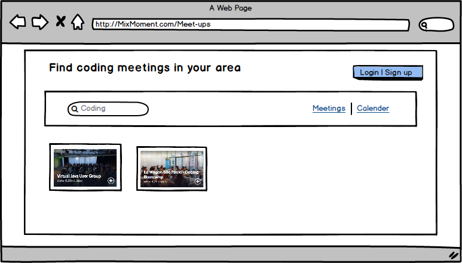

# Mix-Moment
## Team Members

   1. John Jung 
   
   2. Danielle Pabon
   
   3. Rani Rab
   
   4. Shannon Stanford

## Concept
* Mix Moment is a full stack meetup app where users can select their interests and find others in their area with similar interests. Those users can then organize local meetups that others can join.

## Deliverables and Deadlines

- Wednesday, April 25 - Complete initial proposal, wireframe, and file structure

- Thursday, April 26 - Complete welcome page design, create server, databases, and ORM 

- Friday, April 27 - Complete routes and login functionality

- Monday, April 30 - Deploy

- Tuesday, May 1st - Debugging & Presentation Prep

- Wednesday, May 2nd - Presentation

## New Technology

    * Passport - To authenticate users on the site.

## Datasets

    * Users
    * Meetups

## Responsibilities

    * Front End
    
    * Back End

## Layout

   
